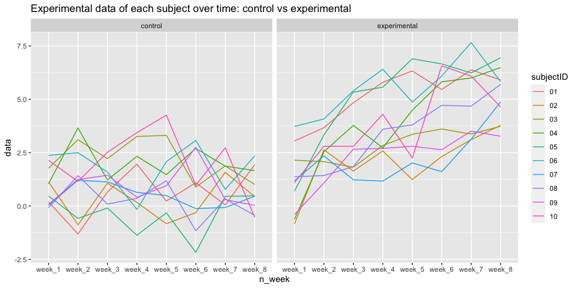

P8105 HW5
================
Jiacheng Wu
11/17/2021

## Problem 1

Read in data

``` r
homi_df =
  read.csv("./homicide-data.csv", na = c("", "Unknown")) %>% 
  mutate(city_state = str_c(city, state),
         resolved = case_when(
           disposition =="Closed without arrest" ~ "unsolved",
           disposition =="Open/No arrest" ~"unsolved",
           disposition =="Closed by arrest" ~ "solved"
         )) %>% 
  filter(city_state != "Tulsa, AL") %>% 
  relocate(city_state)

homi_df =
  homi_df %>% 
  group_by(city_state) %>% 
  summarise(
    n_homi = n(),
    unsol_homi = sum(resolved == "unsolved")
  )
```

``` r
homi_raw = read.csv("./homicide-data.csv", na = c("", "Unknown"))
```

There are 52179 total observations in the raw data and 12 total
variables.

Do a prop test for Baltimore.

``` r
prop.test(
  homi_df %>% filter(city_state == "BaltimoreMD") %>% pull(unsol_homi), 
  homi_df %>% filter(city_state == "BaltimoreMD") %>% pull(n_homi)) %>% 
  broom::tidy()
```

    ## # A tibble: 1 × 8
    ##   estimate statistic  p.value parameter conf.low conf.high method    alternative
    ##      <dbl>     <dbl>    <dbl>     <int>    <dbl>     <dbl> <chr>     <chr>      
    ## 1    0.646      239. 6.46e-54         1    0.628     0.663 1-sample… two.sided

Try to iterate for each city.

``` r
results_df = 
  homi_df %>% 
  mutate(
    prop_tests = map2(.x = unsol_homi, .y = n_homi, ~prop.test(x = .x, n = .y)),
    tidy_tests = map(.x = prop_tests, ~broom::tidy(.x))
  ) %>% 
  select(-prop_tests) %>% 
  unnest(tidy_tests) %>% 
  select(city_state, estimate, conf.low, conf.high)
```

    ## Warning in prop.test(x = .x, n = .y): Chi-squared approximation may be incorrect

Plot the results.

``` r
results_df %>% 
  mutate(city_state = fct_reorder(city_state, estimate)) %>% 
  ggplot(aes(x = city_state, y = estimate)) +
  geom_point() + 
  geom_errorbar(aes(ymin = conf.low, ymax = conf.high)) + 
  theme(axis.text.x = element_text(angle = 90, vjust = 0.5, hjust = 1))
```

<!-- -->

``` r
city_prop_test = function(df) {
  
  n_unsovled
  n_total 
  
  prop.test(.....)
  
}
```

## Problem 2

``` r
file_df = 
  tibble(
    files = list.files("./data")
  )
```

``` r
file2_df = 
  file_df %>% 
  mutate(
    path_df = str_c("./data/", files),
    data = map(path_df, read_csv)
  )
```

``` r
file3_df = 
  file2_df %>% 
  separate(files, into = c("arm", "subjectID", sep = "-")) %>% 
  select(arm, subjectID, data) %>% 
  unnest(data) %>% 
  pivot_longer(
    week_1:week_8,
    names_to = "n_week",
    values_to = "data"
  )
```

Make a spaghetti plot on each subject.

``` r
file3_df %>% 
  mutate(
    arm = recode(arm, con = "control", exp = "experimental")
  ) %>% 
  ggplot(aes(x = n_week, y = data, group = subjectID, color = subjectID)) +
  geom_line() +
  facet_grid(. ~ arm) +
  labs(
    title = "Experimental data of each subject over time: control vs experimental"
  )
```

<!-- -->

## Problem 3

Iris with missing values.

``` r
set.seed(10)

iris_with_missing = iris %>% 
  map_df(~replace(.x, sample(1:150, 20), NA)) %>%
  mutate(Species = as.character(Species))
```

Write the function.

``` r
replace_missing_value = function(vec) {
  
  if (is.numeric(vec)) {
    vec = ifelse(is.na(vec), mean(vec, na.rm = TRUE), vec)
  }
  else {x = ifelse(is.na(vec), "virginica", vec)}
}
```

Run function to the dataset.

``` r
output = map(iris_with_missing, replace_missing_value)
bind_rows(output)
```

    ## # A tibble: 150 × 5
    ##    Sepal.Length Sepal.Width Petal.Length Petal.Width Species
    ##           <dbl>       <dbl>        <dbl>       <dbl> <chr>  
    ##  1         5.1          3.5         1.4         0.2  setosa 
    ##  2         4.9          3           1.4         0.2  setosa 
    ##  3         4.7          3.2         1.3         0.2  setosa 
    ##  4         4.6          3.1         1.5         1.19 setosa 
    ##  5         5            3.6         1.4         0.2  setosa 
    ##  6         5.4          3.9         1.7         0.4  setosa 
    ##  7         5.82         3.4         1.4         0.3  setosa 
    ##  8         5            3.4         1.5         0.2  setosa 
    ##  9         4.4          2.9         1.4         0.2  setosa 
    ## 10         4.9          3.1         3.77        0.1  setosa 
    ## # … with 140 more rows
